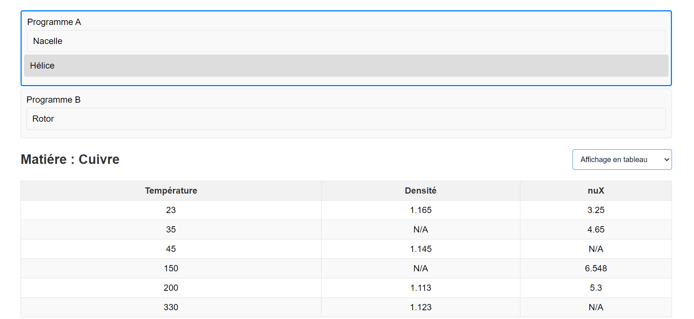
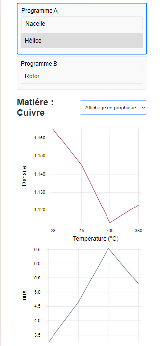
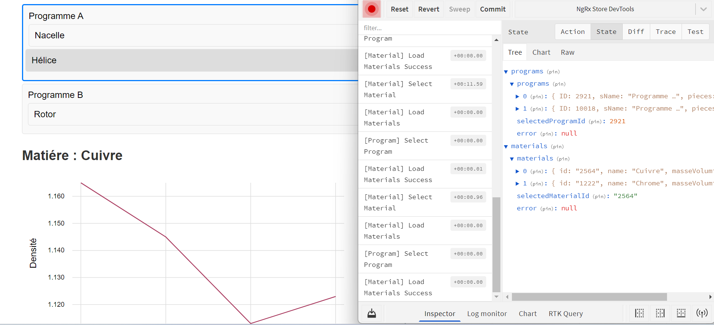

# Front-end-task Angular 16 Project 🚀

This project is a technical test that showcases an Angular application with various features, including state management with NgRx, displaying data in multiple formats, and providing a responsive and mobile-friendly design.

## Key Features 🌟

### Angular CLI 🛠️
The project is built using the Angular CLI, which provides a powerful set of tools for initializing, developing, and maintaining Angular applications.

### State Management with NgRx 🗃️
The application leverages NgRx store for state management, ensuring a unidirectional data flow and making the state predictable. Actions, reducers, and effects are used to handle asynchronous operations and manage the application's state efficiently.

#### Actions 🔄
- **Program Actions:** `loadPrograms`, `loadProgramsSuccess`, `loadProgramsFailure`, `selectProgram`
- **Material Actions:** `loadMaterials`, `loadMaterialsSuccess`, `loadMaterialsFailure`, `selectMaterial`

#### Effects ✨
- **Program Effects:** Handles loading of programs from the data service and dispatching appropriate actions based on the success or failure of the request.

#### Reducers 🧩
- **Program Reducer:** Manages the state of the programs, handling actions related to loading and selecting programs.
- **Material Reducer:** Manages the state of the materials, handling actions related to loading and selecting materials.

### Redux DevTools 🛠️
The application is configured to work with Redux DevTools, allowing for powerful state management debugging and time-travel capabilities. This makes it easier to inspect the application's state, actions, and state changes during development.

### Observable-Based Data Handling 🌐
The application uses Angular's `HttpClient` and RxJS observables to fetch data asynchronously. Observables are used extensively in the components to handle data streams and ensure the application reacts to data changes in real time.

### Component-Based Architecture 🏗️
The application is structured into reusable components, each encapsulating specific functionality and UI. The key components include:
- **Program List Component:** Displays a list of programs and allows users to select a program and its associated pieces.
- **Material Details Component:** Displays detailed information about the selected material, including temperature, density, and Poisson's ratio.

### Responsive and Mobile-Friendly Design 📱💻
The application is designed to be responsive and mobile-friendly, ensuring a seamless user experience across different devices. CSS styles and layout techniques are used to achieve this, including:
- Flexbox layout for responsive design
- Media queries for mobile responsiveness
- Transition effects for hover and selection states

### Dynamic Data Display 📊
The application provides multiple ways to display temperature values and other attributes:
- **Table View:** Displays data in a tabular format for easy comparison.
- **Line View:** Displays data in a linear format.
- **Chart View:** Uses `ngx-charts` to display data in graphical format, providing a visual representation of the material properties.

### Dropdown for View Selection ⬇️
A dropdown is provided to switch between different data display views (table, lines, and chart), allowing users to choose their preferred way of viewing the data.

### Change Detection Strategy ⚙️
The application employs Angular's `ChangeDetectionStrategy.OnPush` to optimize performance by minimizing unnecessary change detection cycles.

### Indexed `ngFor` Loop 🔍
To efficiently track items in `ngFor` loops, the `trackBy` function is used, improving rendering performance by reducing DOM manipulations.

## Folder Structure 🗂️

```
src/
  app/
    components/
      density-chart/
      material-details/
      program-list/
    models/
      material.model.ts
      program.model.ts
    services/
      data.service.spec.ts
      data.service.ts
    store/
      actions/
        material.actions.ts
        program.actions.ts
      effects/
        material.effects.ts
        program.effects.ts
      reducers/
        material.reducer.ts
        program.reducer.ts
      selectors/
        material.selectors.ts
        program.selectors.ts
      store.module.ts
    utils/
    app-routing.module.ts
    app.component.html
    app.component.scss
    app.component.spec.ts
    app.component.ts
    app.module.ts
```

## Installation and Setup 💻

1. **Unzip the repository:**
   ```bash
   cd your-repository
   ```

2. **Install dependencies:**
   ```bash
   npm install
   ```

3. **Run the application:**
   ```bash
   ng serve
   ```

   The application will be available at `http://localhost:4200`.

## Usage 🎯

- Navigate to the Program List to view the available programs.
- Click on a program to load and view its pieces.
- Select a piece to view detailed information about the material.
- Use the dropdown to switch between table, line, and chart views.

## Additional Information 📚

This project includes additional features not explicitly mentioned in the test requirements, such as the chart view for visualizing material properties.
The project demonstrates the variation of data management methods using different data binding techniques such as props, shared store data with NgRx, and local state data. This showcases flexibility and a deep understanding of different state management paradigms in Angular.
 These features demonstrate a understanding of Angular and NgRx basics.

### Screenshots 📸
Below are some screenshots demonstrating the responsiveness and key features of the application. *(Insert images here)*

#### Desktop View 🖥️


#### Mobile View 📱


### Redux DevTools Store 🛠️
The application can be inspected using Redux DevTools, allowing for a comprehensive look at the state changes and dispatched actions.



--------
#FR 🇫🇷
--------

# Front-end-task Projet Angular 16 🚀

Ce projet est un test technique qui présente une application Angular avec diverses fonctionnalités, y compris la gestion d'état avec NgRx, l'affichage des données dans plusieurs formats et la conception responsive adaptée aux mobiles.

## Fonctionnalités Clés 🌟

### Angular CLI 🛠️
Le projet est construit en utilisant Angular CLI, qui fournit un ensemble d'outils puissants pour initialiser, développer et maintenir des applications Angular.

### Gestion d'État avec NgRx 🗃️
L'application utilise le store NgRx pour la gestion d'état, assurant un flux de données unidirectionnel et rendant l'état prévisible. Les actions, réducteurs et effets sont utilisés pour gérer les opérations asynchrones et l'état de l'application de manière efficace.

#### Actions 🔄
- **Actions de Programme:** `loadPrograms`, `loadProgramsSuccess`, `loadProgramsFailure`, `selectProgram`
- **Actions de Matériel:** `loadMaterials`, `loadMaterialsSuccess`, `loadMaterialsFailure`, `selectMaterial`

#### Effets ✨
- **Effets de Programme:** Gère le chargement des programmes à partir du service de données et déclenche les actions appropriées en fonction de la réussite ou de l'échec de la demande.

#### Réducteurs 🧩
- **Réducteur de Programme:** Gère l'état des programmes, traitant les actions liées au chargement et à la sélection des programmes.
- **Réducteur de Matériel:** Gère l'état des matériels, traitant les actions liées au chargement et à la sélection des matériels.

### Redux DevTools 🛠️
L'application est configurée pour fonctionner avec Redux DevTools, permettant une débogage puissante de la gestion d'état et des capacités de voyage dans le temps. Cela facilite l'inspection de l'état de l'application, des actions et des changements d'état pendant le développement.

### Gestion des Données Basée sur les Observables 🌐
L'application utilise `HttpClient` d'Angular et les observables RxJS pour récupérer les données de manière asynchrone. Les observables sont utilisés abondamment dans les composants pour gérer les flux de données et garantir que l'application réagit aux changements de données en temps réel.

### Architecture Basée sur les Composants 🏗️
L'application est structurée en composants réutilisables, chacun encapsulant des fonctionnalités spécifiques et une interface utilisateur. Les composants clés incluent :
- **Composant Liste de Programmes:** Affiche une liste de programmes et permet aux utilisateurs de sélectionner un programme et ses pièces associées.
- **Composant Détails du Matériel:** Affiche des informations détaillées sur le matériel sélectionné, y compris la température, la densité et le coefficient de Poisson.

### Conception Responsive et Adaptée aux Mobiles 📱💻
L'application est conçue pour être responsive et adaptée aux mobiles, garantissant une expérience utilisateur fluide sur différents appareils. Les styles CSS et les techniques de mise en page sont utilisés pour y parvenir, y compris :
- Mise en page Flexbox pour la conception responsive
- Media queries pour l'adaptabilité mobile
- Effets de transition pour les états de survol et de sélection

### Affichage Dynamique des Données 📊
L'application propose plusieurs manières d'afficher les valeurs de température et d'autres attributs :
- **Vue en Tableau:** Affiche les données sous forme de tableau pour une comparaison facile.
- **Vue en Lignes:** Affiche les données sous forme linéaire.
- **Vue en Graphique:** Utilise `ngx-charts` pour afficher les données sous forme graphique, fournissant une représentation visuelle des propriétés des matériaux.

### Dropdown pour la Sélection de Vue ⬇️
Un menu déroulant est fourni pour basculer entre les différentes vues d'affichage des données (tableau, lignes et graphique), permettant aux utilisateurs de choisir leur manière préférée de visualiser les données.

### Stratégie de Détection des Changements ⚙️
L'application emploie `ChangeDetectionStrategy.OnPush` d'Angular pour optimiser les performances en minimisant les cycles de détection des changements inutiles.

### Boucle `ngFor` Indexée 🔍
Pour suivre efficacement les éléments dans les boucles `ngFor`, la fonction `trackBy` est utilisée, améliorant les performances de rendu en réduisant les manipulations du DOM.

## Structure des Dossiers 🗂️

```
src/
  app/
    components/
      density-chart/
      material-details/
      program-list/
    models/
      material.model.ts
      program.model.ts
    services/
      data.service.spec.ts
      data.service.ts
    store/
      actions/
        material.actions.ts
        program.actions.ts
      effects/
        material.effects.ts
        program.effects.ts
      reducers/
        material.reducer.ts
        program.reducer.ts
      selectors/
        material.selectors.ts
        program.selectors.ts
      store.module.ts
    utils/
    app-routing.module.ts
    app.component.html
    app.component.scss
    app.component.spec.ts
    app.component.ts
    app.module.ts
```

## Installation et Configuration 💻

1. **Unzip le dépôt :**
   ```bash
   cd votre-depot
   ```

2. **Installer les dépendances :**
   ```bash
   npm install
   ```

3. **Lancer l'application :**
   ```bash
   ng serve
   ```

   L'application sera disponible à l'adresse `http://localhost:4200`.

## Utilisation 🎯

- Naviguez vers la Liste de Programmes pour voir les programmes disponibles.
- Cliquez sur un programme pour charger et visualiser ses pièces.
- Sélectionnez une pièce pour afficher des informations détaillées sur le matériel.
- Utilisez le menu déroulant pour basculer entre les vues tableau, lignes et graphique.

## Informations Supplémentaires 📚

Ce projet inclut des fonctionnalités supplémentaires non explicitement mentionnées dans les exigences du test, telles que la vue graphique pour visualiser les propriétés des matériaux. 
Le projet démontre la variation des méthodes de gestion des données en utilisant différentes techniques de liaison de données telles que les props, le store partagé avec NgRx, et l'état local. Cela montre la flexibilité et la compréhension des différents paradigmes de gestion des états en Angular
Ces fonctionnalités démontrent une compréhension les bases  d'Angular et de NgRx.

### Captures d'Écran 📸
Voici quelques captures d'écran démontrant la réactivité et les fonctionnalités clés de l'application. *(Insérez les images ici)*

#### Vue Desktop 🖥️


#### Vue Mobile 📱


### Redux DevTools Store 🛠️
L'application peut être inspectée en utilisant Redux DevTools, permettant un aperçu complet des changements d'état et des actions déclenchées.


